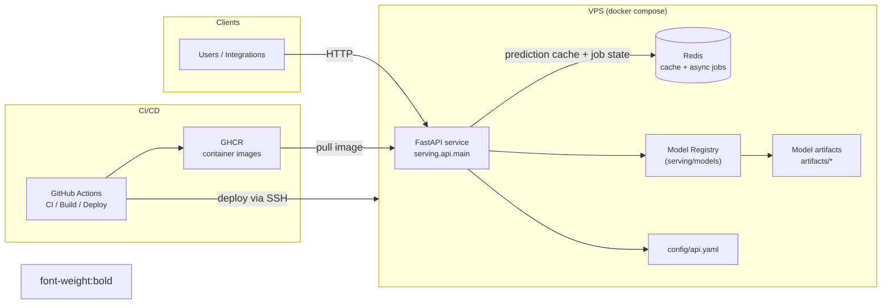

# NFL Model Platform – Serving Architecture

Below is a mermaid diagram of the serving/deploy path. See `files/plan.md` for the broader roadmap and data flow.

```mermaid
flowchart LR
  subgraph Clients
    U["Users / Integrations"]
  end

  subgraph CICD["CI/CD"]
    GH["GitHub Actions\nCI / Build / Deploy"] --> GHCR["GHCR\ncontainer images"]
  end

  subgraph VPS["VPS (docker compose)"]
    API["FastAPI service\nserving.api.main"]
    REDIS[(Redis\ncache + async jobs)]
    REG["Model Registry\n(serving/models)"]
    CFG["config/api.yaml"]
    ARTS["Model artifacts\nartifacts/*"]

    API -->|prediction cache + job state| REDIS
    API --> REG
    API --> CFG
    REG --> ARTS
  end

  U -->|HTTP| API
  GHCR -->|pull image| API
  GH -->|deploy via SSH| VPS

  classDef large font-size:12px;
  classDef section font-size:12px;font-weight:bold;
  class U,GH,GHCR,API,REDIS,REG,CFG,ARTS large;
  class Clients,CICD,VPS section;
  style Clients font-size:12px;
  style CICD font-size:12px;
  style VPS font-size:12px;
```
